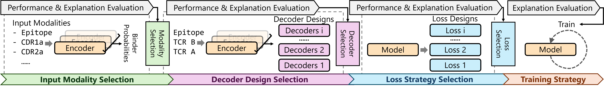

# Rational Multi-Modal Transformers for TCR-pMHC Prediction

T cell receptor (TCR) recognition of peptide–MHC (pMHC) complexes is fundamental to adaptive immunity and central to the development of T cell-based immunotherapies. While transformer-based models have shown promise in predicting TCR–pMHC interactions, most lack a systematic and explainable approach to architecture design. We present an approach that makes use of recent advances in post-hoc explainability to inform the construction of an encoder–decoder transformer model. By identifying the most informative combinations of TCR and epitope sequence inputs, we optimize cross-attention strategies, incorporate auxiliary training objectives, and introduce a novel early-stopping criterion based on explanation quality. Our framework achieves state-of-the-art predictive performance while simultaneously improving explainability, robustness, and generalization. This work establishes a principled, explanation-driven strategy for modeling TCR–pMHC binding and offers mechanistic insights into sequence-level binding behavior through the lens of deep learning.


## Requirements
We recommend to use conda to manage the environment.
The Python version is 3.9 and packages can be installed following `pip install -r requirements.txt`

## Train Models
Run `python train.py` to train the selected model.
You could switch model by changing `config_path = 'projects/representations/configs/cdr3_only_binder.json'`. The list of model configs can be found below.

## Evaluate Models
Run `python posthoc.py` to use posthoc mothods to evaluate the selected model. You could switch model by changing `checkpoint_path = 'projects/representations/cdr3_only_binder'`, and the `posthoc_config = 'configs/posthocs/cdr3_only_binder.json'` requires to be switched to the corresponding posthoc configuration. 

## Models

|Model Name|Inputs|Loss|Config Path|Posthoc Config Path|
|:---------|:-----|:---|:----------|:------------------|
|EGM-0|`epitope` `TCR A` `TCR B`|binder,MLM|`projects/modeldesigns/cotcrabsep_2peptide_binder/config.json`|`configs/posthocs/cotcrabsep_2peptide_binder.json`|
|EGM-1|`epitope` `TCR A` `TCR B`|binder,MLM|`projects/modeldesigns/precotcrabsep_2peptide_binder/config.json`|`configs/posthocs/precotcrabsep_2peptide_binder.json`|
|EGM-2|`epitope` `TCR A` `TCR B`|binder,MLM|`projects/modeldesigns/precotcrabsep_2peptide_binder_v2/config.json`|`configs/posthocs/precotcrabsep_2peptide_binder_v2.json`|
|CDR3b Only|`CDR3b`|binder,MLM|`projects/representations/cdr3b_no_epitope/config.json`|`configs/posthocs/cdr3b_no_epitope.json`|
|Epitope Only|`epitope`|binder,MLM|`projects/representations/epitope_only/config.json`|`configs/posthocs/epitope_only.json`|
|CDR3b + Epitope|`CDR3b` `epitope`|binder,MLM|`projects/representations/cdr3b_only_binder/config.json`|`configs/posthocs/cdr3b_only_binder.json`|
|CDR3s + Epitope|`CDR3a` `CDR3b` `epitope`|binder,MLM|`projects/representations/cdr3_only_binder/config.json`|`configs/posthocs/cdr3_only_binder.json`|
|All CDRs + Epitope|`CDR1a` `CDR2a` `CDR3a` `CDR1b` `CDR2b` `CDR3b` `epitope`|binder,MLM|`projects/representations/cdr123_binder/config.json`|`configs/posthocs/cdr123_binder.json`|
|TCR B + All CDR3as + Epitope|`CDR1a` `CDR2a` `CDR3a` `TCRB` `epitope`|binder,MLM|`projects/representations/tcrb_cdra_binder/config.json`|`configs/posthocs/tcrb_cdra_binder.json`|
|TCR A + All CDR3bs + Epitope|`CDR1b` `CDR2b` `CDR3b` `TCRA` `epitope`|binder,MLM|`projects/representations/tcra_cdrb_binder/config.json`|`configs/posthocs/tcra_cdrb_binder.json`|
|TCRs + Epitope|`TCRA` `TCRB` `epitope`|binder,MLM|`projects/representations/tcrab_binder/config.json`|`configs/posthocs/tcrab_binder.json`|
|TCRs + All CDRs + Epitope|`TCRA` `TCRB` `CDR1a` `CDR2a` `CDR3a` `CDR1b` `CDR2b` `CDR3b` `epitope`|binder,MLM|`projects/representations/tcrab_cdr123_binder/config.json`|`configs/posthocs/tcrab_cdr123_binder.json`|
|Epitope->CDR3b|`epitope` `CDR3b`|binder,MLM|`projects/crossattentions/peptide2cdr3b_binder/config.json`|`configs/posthocs/peptide2cdr3b_binder.json`|
|Epitope->CDR3b+CDR3b|`epitope` `CDR3b`|binder,MLM|`projects/crossattentions/cdr3b_peptide2cdr3b_binder/config.json`|`configs/posthocs/cdr3b_peptide2cdr3b_binder.json`|
|Epitope->CDR3b+Epitope|`epitope` `CDR3b`|binder,MLM|`projects/crossattentions/peptide_peptide2cdr3b_binder/config.json`|`configs/posthocs/peptide_peptide2cdr3b_binder.json`|
|CDR3b->Epitope|`epitope` `CDR3b`|binder,MLM|`projects/crossattentions/cdr3b2peptide_binder/config.json`|`configs/posthocs/cdr3b2peptide_binder`|
|CDR3b->Epitope+CDR3b|`epitope` `CDR3b`|binder,MLM|`projects/crossattentions/cdr3b_cdr3b2peptide_binder/config.json`|`configs/posthocs/cdr3b_cdr3b2peptide_binder.json`|
|CDR3b->Epitope+Epitope|`epitope` `CDR3b`|binder,MLM|`projects/crossattentions/peptide_cdr3b2peptide_binder/config.json`|`configs/posthocs/peptide_cdr3b2peptide_binder.json`|
|CDR3b<->Epitope|`epitope` `CDR3b`|binder,MLM|`projects/crossattentions/cotcrab2peptide_binder/config.json`|`configs/posthocs/cotcrab2peptide_binder.json`|
|EGM-1 Classification Only|`epitope` `TCR A` `TCR B`|binder|`projects/lossdesigns/classification_only/config.json`|`configs/posthocs/precotcrabsep_2peptide_binder.json`|
|EGM-1 MHC Loss|`epitope` `TCR A` `TCR B`|binder, MLM, MHC|`projects/lossdesigns/mhc_loss/config.json`|`configs/posthocs/precotcrabsep_2peptide_binder.json`|
|EGM-1 TRVJ Loss|`epitope` `TCR A` `TCR B`|binder, MLM, TRVJ|`projects/lossdesigns/trvj_loss/config.json`|`configs/posthocs/precotcrabsep_2peptide_binder.json`|
|EGM-2 Classification Only|`epitope` `TCR A` `TCR B`|binder|`projects/lossdesigns/classification_only_v2/config.json`|`configs/posthocs/precotcrabsep_2peptide_binder_v2.json`|
|EGM-2 MHC Loss|`epitope` `TCR A` `TCR B`|binder, MLM, MHC|`projects/lossdesigns/mhc_loss_v2/config.json`|`configs/posthocs/precotcrabsep_2peptide_binder_v2.json`|
|EGM-2 TRVJ Loss|`epitope` `TCR A` `TCR B`|binder, MLM, TRVJ|`projects/lossdesigns/trvj_loss_v2/config.json`|`configs/posthocs/precotcrabsep_2peptide_binder_v2.json`|


## Cite
```bibtex
@inproceedings{li2025rational,
  title={Rational Multi-Modal Transformers for TCR-pMHC Prediction},
  author={Li, Jiarui and Yin, Zixiang and Ding, Zhengming and Landry, Samuel J and Mettu, Ramgopal R},
  booktitle={Proceedings of the 15th ACM International Conference on Bioinformatics, Computational Biology and Health Informatics},
  year={2025}
}
```
For QCAI and TCRXAI, please cite:
```bibtex
@article{li2025quantifying,
  title={Quantifying Cross-Attention Interaction in Transformers for Interpreting TCR-pMHC Binding},
  author={Li, Jiarui and Yin, Zixiang and Smith, Haley and Ding, Zhengming and Landry, Samuel J and Mettu, Ramgopal R},
  journal={arXiv preprint arXiv:2507.03197},
  year={2025}
}
```
